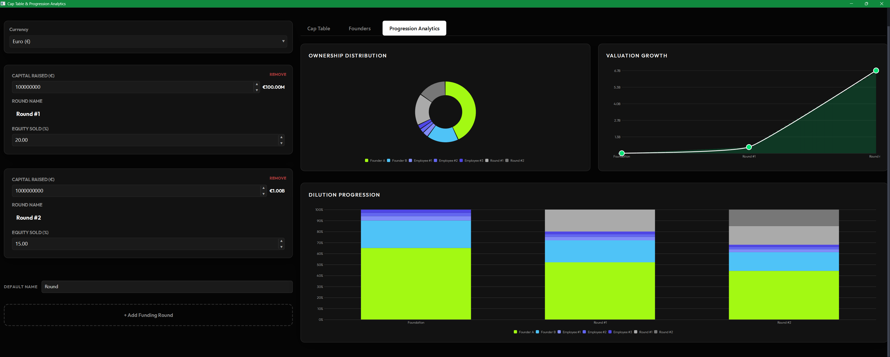

# mUI Cap Table & Charts Demo

A full **Cap Table Manager** with live equity dilution analytics — built in C++ using native HTML/CSS rendering.

No Electron. No WebView. No browser engine. **~5MB binary.**

---

## 📸 Screenshots



---

## ✨ What this demo shows

This is a showcase for the **mUI framework** — specifically its Chart.js-inspired native chart widgets. The Cap Table app was built as a real-world stress test for the charting system and ended up being a fully functional tool.

- **Native chart widgets** — Pie, Doughnut, Line (with area fill + bezier tension), and Stacked Bar charts, all rendered natively in C++ with a Chart.js-inspired API
- **Live recalculation** — equity, dilution, and valuation update in real time as you edit any field
- **Full dilution model** — founder ownership tracked across multiple funding rounds with per-round investor series
- **Color pickers per founder** — charts update live as colors change
- **JSON import / export** — save and reload your cap table state
- **Double-click inline editing** — round titles and company name editable directly in the UI
- **Tab state restoration** — switching tabs preserves all live state

---

## 📐 Chart API

Charts are driven by a clean data-first API inspired by Chart.js:
```cpp
auto chart = m_orch->getChart("valuationChart");

chart->configureStyle([](ChartStyle& s) 
{
    s.showTooltip = true;
    s.beginAtZero = true;
    s.fill        = true;
    s.tension     = 0.4f;
});

ChartData data;
ChartSeries s;
s.label  = "Post-Money";
s.values = { 0.f, 5'000'000.f, 25'000'000.f };
data.series.push_back(s);

chart->setData(data);
```

No browser. No JavaScript. Pure C++.

---

## 🔒 About mUI

**mUI** is a high-performance UI framework designed for efficiency and flexibility. 

> [!NOTE]
> mUI is currently a private framework. If you are interested in the framework or have any questions about this showcase, please **[contact me](https://github.com/M4iKZ)** for more information.

---

## 🚀 More Demos

Check out these other projects built with the mUI framework:

*   **[mUI Showcase](https://github.com/M4iKZ/mUI-showcase)**: A collection of 3 examples focusing on:
    *   **Standards**: Essential UI components and layout patterns.
    *   **Inputs**: Advanced form handling and interactive inputs.
    *   **Image Viewer**: High-performance image rendering and manipulation.
*   **[mUI Sudoku Demo](https://github.com/M4iKZ/mui-sudoku-demo)**: A simple and fun Sudoku game demonstrating game logic integration with mUI.
